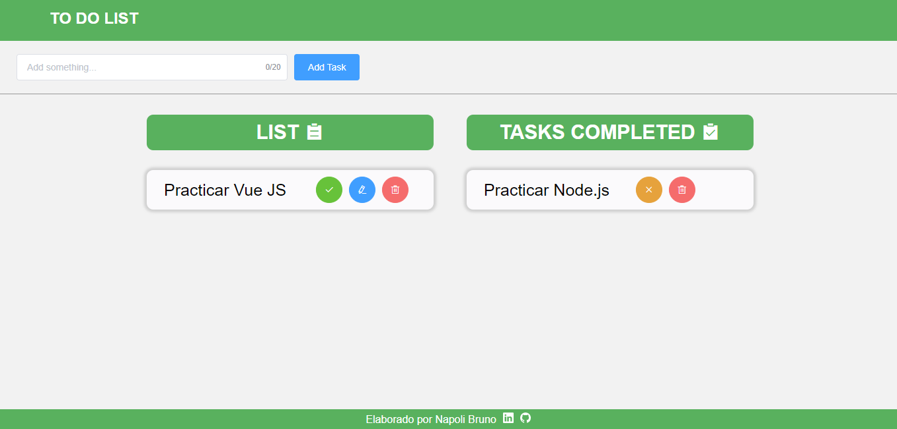

# To Do List 📜

> <h2> A to do list using Vue.js 2.0 and Element Ui. </h2>

## Quick Start

```bash
# Install dependencies
npm install

# Start Vue App: http://localhost:8080
npm run serve
```

## App Info

> A to do list where you can add, edit and delete your tasks of the day.

### Preview



### Author

Napoli Bruno